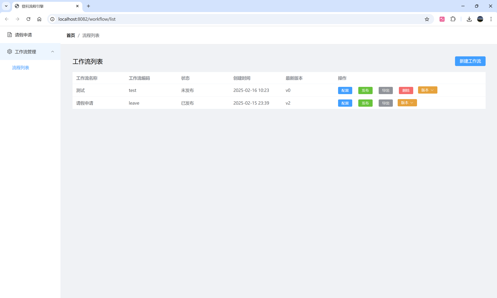
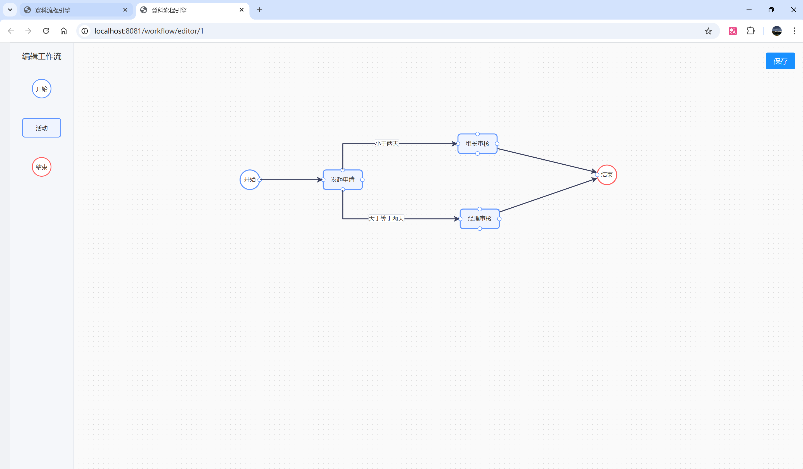
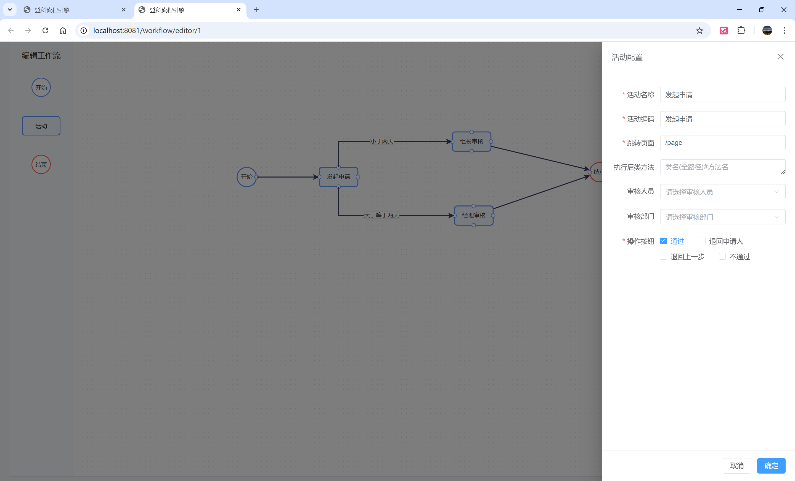
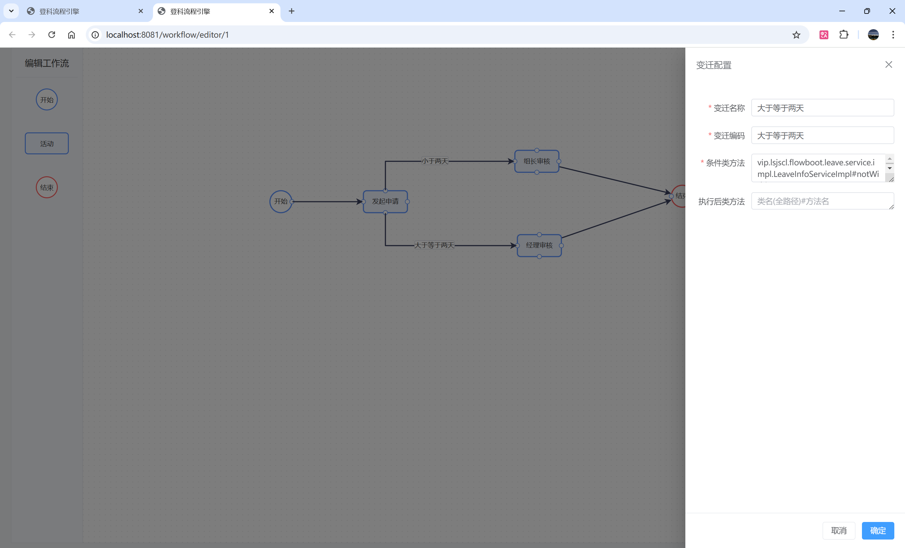
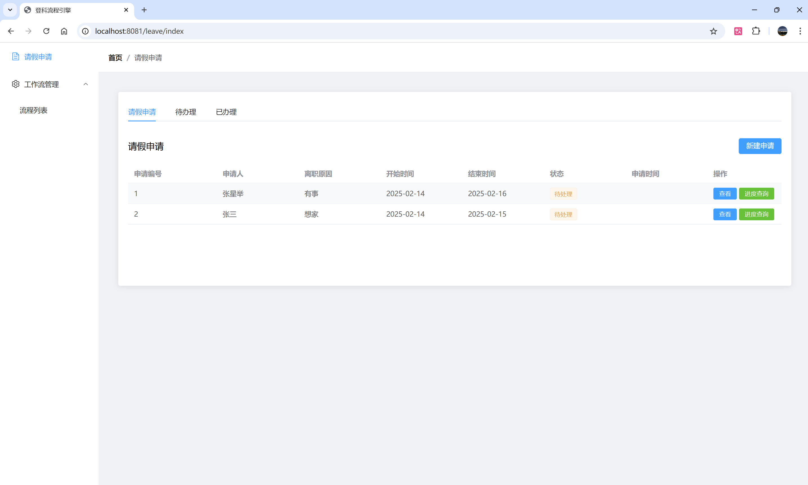
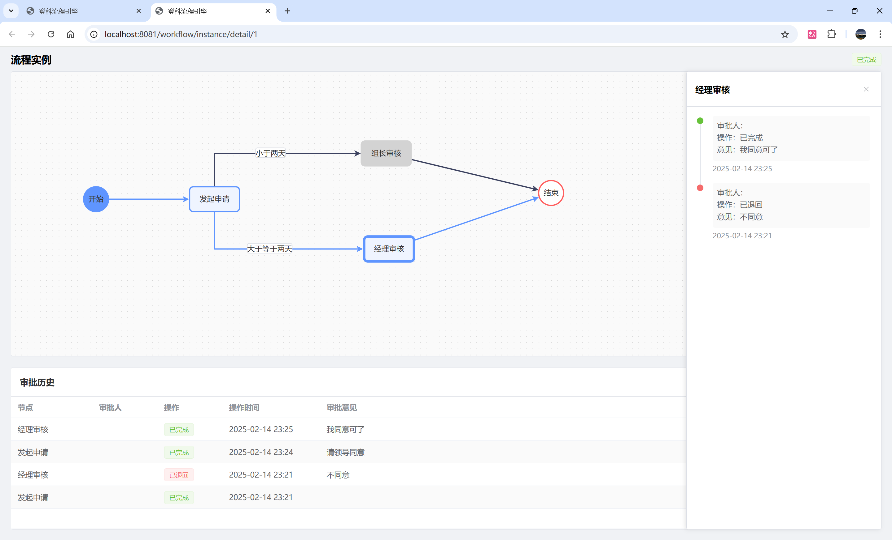

# 登科流程引擎

一个基于 Spring Boot 的轻量级工作流引擎，支持图形化流程设计、版本管理、任务处理和流程追踪。

## 快速开始

### 1. Maven 依赖

```xml
<dependency>
    <groupId>vip.lsjscl</groupId>
    <artifactId>flowboot-spring-boot-starter</artifactId>
    <version>1.0.0</version>
</dependency>
```

### 2. 数据库配置

```yaml
spring:
  datasource:
    url: jdbc:mysql://localhost:3306/workflow
    username: root
    password: root
```

### 3. 删除策略配置（可选）

```yaml
flow-boot:
  physical-delete: false  # true为物理删除，false为逻辑删除(默认)
```

### 4. 集成用户系统

```java
@Component
public class CustomUserInfoProvider implements UserInfoProvider {
    @Override
    public String getCurrentUserId() {
        return SecurityUtils.getCurrentUserId();
    }
    
    @Override
    public String getCurrentUsername() {
        return SecurityUtils.getCurrentUsername();
    }
}
```

## 集成方式

### 1. Vue项目集成

```bash
# 安装依赖
npm install @lsjscl/workflow-ui
# 或
yarn add @lsjscl/workflow-ui
```

```javascript
// main.js
import { createApp } from 'vue'
import WorkflowUI from '@lsjscl/workflow-ui'
import '@lsjscl/workflow-ui/dist/style.css'

const app = createApp(App)
app.use(WorkflowUI)
app.mount('#app')
```

```vue
<template>
  <!-- 流程设计器 -->
  <workflow-designer 
    :workflow-id="workflowId"
    @save="handleSave"
  />
  
  <!-- 流程查看器 -->
  <workflow-viewer
    :business-id="businessId"
    :workflow-code="workflowCode"
  />
</template>
```

### 2. 原生HTML集成

```html
<!DOCTYPE html>
<html>
<head>
  <meta charset="UTF-8">
  <title>工作流示例</title>
  <!-- 引入样式 -->
  <link rel="stylesheet" href="https://unpkg.com/@lsjscl/workflow-ui/dist/style.css">
  <!-- 引入脚本 -->
  <script src="https://unpkg.com/@lsjscl/workflow-ui/dist/workflow.umd.js"></script>
</head>
<body>
  <!-- 业务表单 -->
  <div class="business-content">
    <h2>请假申请</h2>
    <form id="leaveForm">
      <!-- 表单内容 -->
    </form>
  </div>
  
  <!-- 流程操作区域 -->
  <div id="workflowContainer"></div>
  
  <script>
    // 初始化工作流插件
    const workflow = new WorkflowPlugin({
      container: 'workflowContainer',
      businessId: '2024001',  // 业务ID
      workflowCode: 'LEAVE',  // 流程编码
      baseUrl: 'http://localhost:8080',  // 后台接口地址
      onTaskComplete: function(result) {
        // 处理任务完成后的回调
        console.log('任务处理结果:', result);
        // 刷新页面或其他操作
        location.reload();
      }
    });
  </script>
</body>
</html>
```

### 3. React项目集成

```bash
# 安装依赖
npm install @lsjscl/workflow-ui
```

```jsx
import { WorkflowDesigner, WorkflowViewer } from '@lsjscl/workflow-ui';
import '@lsjscl/workflow-ui/dist/style.css';

function App() {
  return (
    <div>
      <WorkflowDesigner 
        workflowId="workflow-001"
        onSave={(data) => console.log('保存数据:', data)}
      />
      
      <WorkflowViewer
        businessId="business-001"
        workflowCode="LEAVE"
      />
    </div>
  );
}
```

## 核心功能

- 图形化流程设计器
- 流程版本管理
- 多种任务处理方式（审批、驳回、退回等）
- 待办/已办任务查询
- 流程历史记录追踪
- 自定义表单集成

## 使用示例

### 1. 启动工作流

```java
@Autowired
private WorkflowService workflowService;

public void startProcess() {
    // 启动一个请假流程
    String businessId = "LEAVE-2024-001";  // 业务ID
    String workflowCode = "LEAVE_PROCESS"; // 流程编码
    workflowService.startWorkflow(workflowCode, businessId);
}
```

### 2. 处理任务

```java
@Autowired
private RuntimeTaskService taskService;

public void handleTask(String businessId, ProcessDataDto processData) {
    // 处理任务
    taskService.processTasks(businessId, processData);
}
```

### 3. 查询任务

```java
@Autowired
private RuntimeTaskService taskService;

// 获取运行时任务
List<RuntimeTask> tasks = taskService.getTasksByBusinessId(businessId);
```

## API 接口

### 工作流相关
```
GET    /api/workflow/list           # 获取工作流列表
POST   /api/workflow/create         # 创建工作流
POST   /api/workflow/update         # 更新工作流
POST   /api/workflow/publish        # 发布工作流
DELETE /api/workflow/delete         # 删除工作流
```

### 任务相关
```
GET  /api/workflow/runtime-tasks           # 获取运行时任务
POST /api/workflow/runtime-tasks/process   # 处理任务
```

## 数据库表结构

- dk_workflow：工作流定义表
- dk_workflow_version：工作流版本表
- dk_activity：活动节点表
- dk_transition：流转关系表
- dk_runtime_task：运行时任务表
- dk_history_task：历史任务表

## 系统展示








## 技术支持

- 文档：[https://flowboot.lsjscl.vip](https://flowboot.lsjscl.vip)
- 问题反馈：[Gitee Issues](https://gitee.com/zhang_xing_ju/dk-workflow/issues)
- 交流：QQ 1533195362

## 许可证

MIT License
